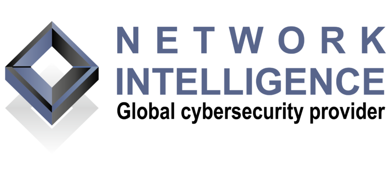

---

layout: col-sidebar
title: OWASP Mumbai
tags: Mum
level: 0
region: Asia
country: India
meetup-group: owasp-mumbai-chapter

---
## Welcome
Welcome to the OWASP Mumbai Chapter home page!

The Mumbai Chapter has been active & rebooted in August 2019. We organise local events throughout the year, the talks are hosted once a month on the fourth Saturday.
Your chapter leaders are [Yash Roongta](https://twitter.com/acc3ssp0int), and [Anantkumar Joshi](https://twitter.com/w1r3sh65rk)

## Our Goals
### Equality
We aim to bring together people from research, academia and industry to motivate, and empower others to pursue a career in cybersecurity. By raising awareness we work towards increasing diversity and equality in cybersecurity.

### Education
We are committed to helping discover the next generation of cybersecurity talent. We aim to offer mentorship programs to educate those new to cybersecurity, and provide talks from industry professionals to showcase all cybersecurity has to offer.

### Community Engagement
We want to help you connect with like-minded individuals. Whether you are new to cybersecurity or a seasoned veteran, our goal is to build a community where everyone can openly discuss and explore current issues in cybersecurity, employment opportunities and more. By providing networking opportunities, we want everyone to get involved in the community and establish relationships with new people.

Next Meeting/Event <!-- You should keep this section as it will populate your meetup events -->
---------------------


## Our Supporters
A Special thanks to Network Intelligence India (NII) for being a generous host to the OWASP Meetups

